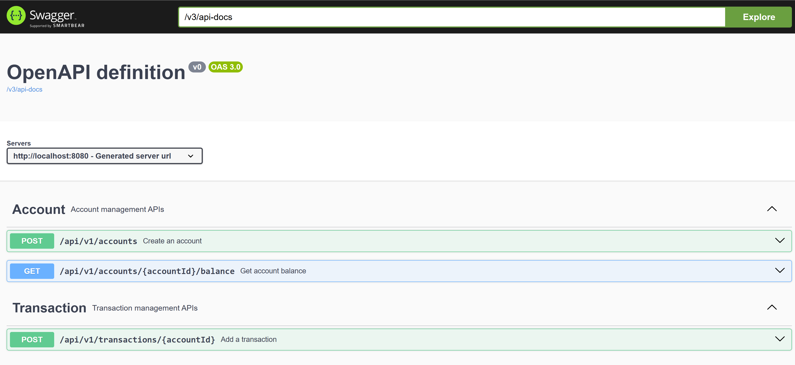
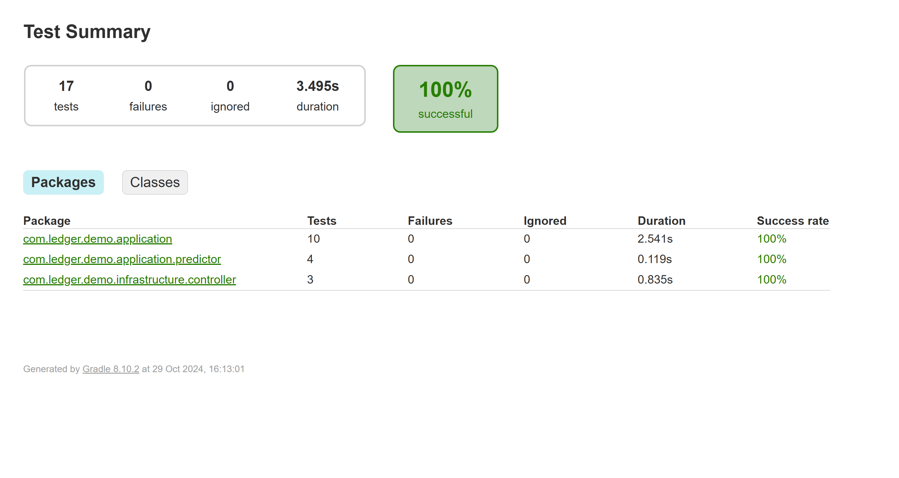

## Problem Summary

- For an end-user, build a Spring Boot service that is a transaction ledger, storing
  transactions against an account allowing users to request their balance at any
  point in time—past, present, or future?

## Solution Discussion

- The Predictive Transaction Ledger Service is a SpringBoot application that acts as a transaction ledger, 
  storing transactions against an account via relationalDB (Postgres) and allowing users to query their balance 
  at any point in time—past, present, or future. The service uses Hexagonal Architecture for modularity of adaptors,
  domains and ports, thus allowing ease of maintainability in the future. The service leverages linear regression 
  to predict future balances based on transaction history range that is selected.

## Features

Balance Calculation Rest-APIs:
Users can query their account balance at any point in time based on future present of past date ranges.
Past and Present Dates: Retrieves balances based on existing transaction history.
Future Dates: Uses linear regression to predict the future balance based on historical transaction patterns.

- Account Management Rest-APIs:
Ability to add new accounts to persist

- Transaction Management Rest-APIs:
Ability to add new transaction against a given account to persist

To find out more about the Rest-APIs please see swagger/OpenAPI docs below

## Why Use Linear Regression for Future Balance Prediction?
- As linear regression is a straightforward, effective statistically method for identifying trends in time series data. 
  In the context of this service (To estimate the future account balance by analyzing past transactions data), benefits are:
  1. This algorithm works well for predicting future values based on historical data, assuming a linear trend.
  2. Easier to interpret, linear regression provides a simple formula that can be extended in the future to predict values at any point in time,
     making it easy to apply to financial data.

## How Linear Regression when predicting future ledger
- In this case I've used linear regression as a best-fit line that models the relationship between time (days) and cumulative balance:
  - X-axis: Represents time (in days) since the start of the historical period.
  - Y-axis: Represents the cumulative balance at each transaction point.
  
  The linear regression formula used to predict future balance:
  ```
    y=mx+b
  ```

- Meaning:

  y = Predicted cumulative balance
  
  m = Slope of the trend line (calculated from past data)
  
  x = Number of days since the start date of the historical period
  
  b = Y-intercept (starting balance)
  

### Why Hexagonal Architecture?
- Hexagonal Architecture provides a lot of benefits for this kind of micro-service:
  1. Separation of Concerns:
     Core business logic (calculating balances) is decoupled from infrastructure (database, API controllers).
     Each layer interacts through interfaces, making the service modular and easy to modify and swapout without impacting other parts.
     Testability:
  2. Each component like prediction logic, database adapters etc, is isolated and can be tested independently.
     For example, the PredictionService can be unit tested without a database, and the database interactions can be tested independently.
     Flexibility:

  Thus the architecture allows for adding new adapters (e.g., switching databases from H2 to PostgreSQL) without changing core logic.
  Future enhancements, such as adding a new way to calculate future balances or integrating with other systems, can be
  achieved by adding adapters and ports.

### Tech Stack Used
- Gradle-Kotlin
- Kotlin Service Impl
- Junit5 (Testing framework)
- SpringBoot dependency framework
- Swagger-docs (Describes Rest-API definition)
- Java-docs
- Liquibase (Schema Migration)
- PostgresDB (Relational DB)

## Gradle Build
```
/gradlew clean build`
```

## Running in prod env
- Use gradle and run up the service with the following environment variables
```
SPRING_DATASOURCE_URL=""
SPRING_DATASOURCE_USERNAME=""
SPRING_DATASOURCE_PASSWORD=""
```
```
./gradlew run
```

## Docker-compose Run
- You can run the service locally within docker env, by building the docker-container (DockerFile) and then orchestrating and deploying it 
  via docker-compose alongside postgresDB

```
docker-compose up --build
```

Teardown:
```
docker-compose down
```

## Rest Endpoint Invocation
- Utilize postman or via curl and invoke services rest endpoint e.g.
```
curl -X GET http://localhost:8080/api/v1/accounts/12345/balance?fromTransactionDateTime=2024-07-01T12%3A34%3A56.000Z&toTransactionDateTime=2024-08-01T12%3A34%3A56.000Z
```

Example response:
```
{
  "accountId": 1,
  "balance": 100
}
```

## Swagger Docs
- To understand the exposed rest endpoints further and describe the response structure, we have the
  ability to access the swagger ui docs. Which can be accessed whilst the service is running via a browser,
  using this endpoint:
```
http://localhost:8080/swagger-ui/index.html
```


## Code coverage
- After running a `gradle clean build`, you should then see code coverage results within the following index.html file path:
```
...\build\reports\jacoco\index.html
```

